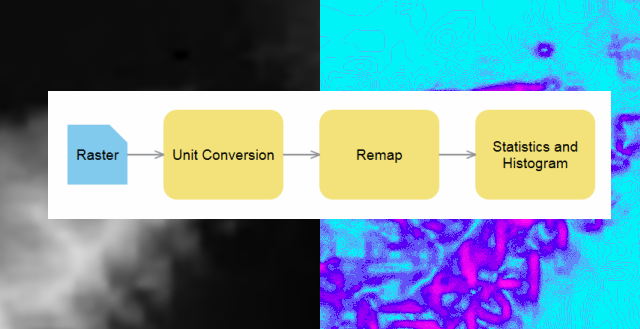

# solutions-raster-functions

Raster functions can be applied to raster datasets and mosaic datasets for fast, accurate analytic capabilities.

## Features

* The [**suitability**](./suitability/README.MD) folder contains:
  * Military Aspects of Weather functions

## Sections

* [Requirements](#requirements)
* [Instructions](#instructions)
* [Resources](#resources)
* [Issues](#issues)
* [Contributing](#contributing)
* [Licensing](#licensing)

## Requirements

* ArcGIS Desktop 10.3 or later or ArcGIS Pro v1 or later
* Pywin build 219 or later or similar ide.

## Instructions

### General Help

* [New to Github? Get started here.](http://htmlpreview.github.com/?https://github.com/Esri/esri.github.com/blob/master/help/esri-getting-to-know-github.html)
* [Getting started with image and raster processing](http://pro.arcgis.com/en/pro-app/help/data/imagery/get-started-with-image-and-raster-processing.htm)
* [Apply functions to a dataset](http://pro.arcgis.com/en/pro-app/help/data/imagery/apply-functions-to-a-dataset.htm)

### Getting Started

* Download the solutions-raster-functions repo to your local computer.
* These raster functions are designed to be work with mosaic datasets only and only with NAM data in the OpenDAP format.  If the user wants to use other data formats then the raster functions and associated Python scripts will have to be edited.
* Information on building raster functions can be found  here (https://github.com/Esri/raster-functions/wiki) and here (https://github.com/Esri/raster-functions) and here for Python raster functions (https://github.com/Esri/raster-functions/wiki/PythonRasterFunction)
* They have been built with NAM CONUS (12KM) downloaded in the OpenDAP format obtained from here (http://nomads.ncep.noaa.gov/)
* All raster functions and scripts should be copied to a folder on a local drive on your computer.
* For the raster functions that use Python scripts such as DeriveWindChillUV.rft.xml the location of the Python script will have to be changed.  This can be done in 2 ways
	* It can be edited directly within xml by finding the .py file and changing the location.
	* It can be edited within ArcGIS through the Raster Function editor and double clicking on Python module name.
* With ArcGIS Desktop 10.3
	* Add the raster functions to the mosaic dataset as processing templates.
	* Add mosaic dataset to project and then apply relevant processing template.
* With ArcGIS Pro:
	* The Mosaic dataset needs to be within a database within the databases section.
	* The Set Mosaic Dataset Properties geoprocessing tool then needs to be run.
	* Under the Image Processing the tab the Raster Functions should be added as Processing templates one by one.
	* To run them within ArcGIS Pro 1st select the layer you want apply it to from the table of contents then select Mosaic Layer - Data from the ribbon bar at the top and select the relevant Raster Function from the processing templates drop down.

## Resources

* [ArcGIS Pro](https://pro.arcgis.com/en/pro-app/community/)

## Issues

Find a bug or want to request a new function?  Please let us know by submitting an issue.

## Contributing

Esri welcomes contributions from anyone and everyone. Please see our [guidelines for contributing](https://github.com/esri/contributing).

## Licensing

Copyright 2015 Esri

Licensed under the Apache License, Version 2.0 (the "License");
you may not use this file except in compliance with the License.
You may obtain a copy of the License at

   [http://www.apache.org/licenses/LICENSE-2.0](http://www.apache.org/licenses/LICENSE-2.0)

Unless required by applicable law or agreed to in writing, software
distributed under the License is distributed on an "AS IS" BASIS,
WITHOUT WARRANTIES OR CONDITIONS OF ANY KIND, either express or implied.
See the License for the specific language governing permissions and
limitations under the License.

A copy of the license is available in the repository's
[license.txt](license.txt) file.

